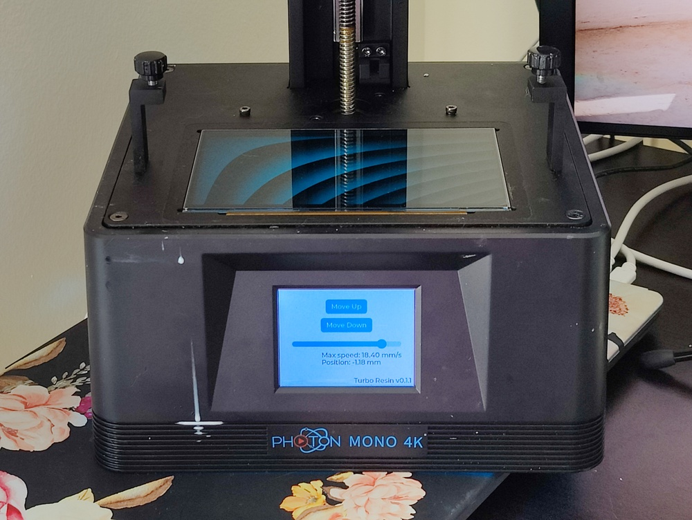

[](https://discord.gg/9HSMNYxPAM)

Turbo Resin: open-source firmware for resin printers
====================================================



Turbo Resin is an open-source firmware for SLA resin printers.

This is the implementation of a firmware based on the
[Reverse engineering of the Anycubic Photon Mono 4K](https://github.com/nviennot/reversing-mono4k#readme)

## Roadmap

Drivers:
* [X] Read the touch screen
* [X] Display on the touch screen
* [X] Use the LVGL UI library
* [X] Control the stepper motor
* [X] Read/write to external Flash
* [ ] Read/write to external EEPROM
* [X] Drive the LCD panel
* [X] Read from USB flash drive
* [ ] Control the UV light
* [X] Z=0 detection
* [ ] Being able to flash firmware via USB

Printing features:
* [X] Better Z-Axis motion control for faster prints with fast deceleration
* [X] Z=0 calibration
* [X] Read .pwma files from USB flash drive
* [ ] Support multiple exposure (like RERF but configurable)
* [ ] Print algorithm
* [ ] Support more file formats to support various slicers
* [ ] Add support for other printers
* [ ] Build-plate force feedback for speed optimization. Following [the work of Jan Mrázek](https://blog.honzamrazek.cz/2022/01/prints-not-sticking-to-the-build-plate-layer-separation-rough-surface-on-a-resin-printer-resin-viscosity-the-common-denominator/)
* [ ] Over-expose structural region of the print to add strength while letting
    edges be normally exposed

## Support for other printers

The first set of printers we'd like to support are the AnyCubic, Phrozen,
Elegoo, and Creality printers.

## Sponsors

* [Elliot from Tiny Labs](https://github.com/tinylabs)
* [@gnivler](https://github.com/gnivler)
* [Madeleine](https://github.com/madelbrot)

Thank you!

## Flashing the firmware

As of now, there's no official distribution to flash the firmware via a USB
stick. You'll need:
* A probe like JLink or [ST-Link V2](https://www.amazon.com/HiLetgo-Emulator-Downloader-Programmer-STM32F103C8T6/dp/B07SQV6VLZ) ($11)
* A 3mm hex screwdriver

## Compiling the firmware

### Prerequisites

Install the Rust toolchain. Following instructions of the [installation section of
the Rust Embedded Book](https://docs.rust-embedded.org/book/intro/install.html),
run the following:

```bash
curl --proto '=https' --tlsv1.2 -sSf https://sh.rustup.rs | sh
source $HOME/.cargo/env
rustup component add llvm-tools-preview
cargo install cargo-binutils
# Ubuntu/Debian
sudo apt install -y gcc-arm-none-eabi gdb-multiarch libclang-dev openocd
# macOS
brew install armmbed/formulae/arm-none-eabi-gcc openocd
```

You are ready for building and flashing the firmware.

### Configure the build

If you are using vscode, replace `saturn` with the printer of your choice in
`./.vscode/settings.json`

Configure the `PRINTER`, `PROBE`, and `FLASH_WITH` variables in the Makefile.
* `PRINTER` can be `mono4k` or `saturn`.
* `PROBE` can be `jlink` or `stlink`.
* `FLASH_WITH` can be `jlink+gdb`, or `openocd+gdb`, or `probe-run`. Pick the
  one that works for you.

### Connect to the printer

Connect your JLink or ST-Link V2 probe to the SWD header on the printer board.
Pinout is shown in [Reverse engineering the Anycubic Photon Mono 4K Part1](
https://github.com/nviennot/reversing-mono4k/blob/main/writeup/part1/README.md)
You can also come and ask for guidance on our [Discord channel](https://discord.gg/9HSMNYxPAM).

### `make` targets

* `make start_probe`: Starts the JLink or OpenOCD gdb server. You must run this in a
  separate terminal when using `FLASH_WITH=jlink+gdb` or
  `FLASH_WITH=openocd+gdb` prior to other commands.
* `make start_probe_rtt`: Show the logging statement emitted from the board.
* `make run`: Compile the code and flash the board
* `make check`: Check that the code is valid. (runs `cargo check` under the cover).
* `make build`: Builds the firmware to be flashed
* `make flash`: Flashes the compiled code to the board
* `make attach`: Provides a GDB console to the running code on board. Execute
  `c` and `ctrl+c` to break into a running target.
* `make attach_bare`: Provides a GDB console to the running code on board, but
  doesn't assume that the code running on the board is the one that was just
  compiled
* `make restore_rom`: Flashes back the original firmware. But you must dump the
  original firmware first. The instructions are shown when running this command.

## License

Turbo Resin is licensed under the GPLv3, except for the USB Host stack, which is
license under Apache 2.0 or MIT at your choice.
