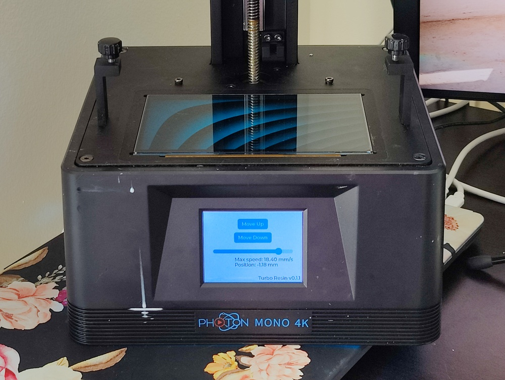

[](https://discord.gg/9HSMNYxPAM)

Turbo Resin: open-source firmware for resin printers
====================================================



Turbo Resin is an open-source firmware for SLA resin printers.

This is the implementation of a firmware based on the
[Reverse engineering of the Anycubic Photon Mono 4K](https://github.com/nviennot/reversing-mono4k#readme)

## Roadmap

Drivers:
* [X] Read the touch screen
* [X] Display on the touch screen
* [X] Use the LVGL UI library
* [X] Control the stepper motor
* [X] Read/write to external Flash
* [ ] Read/write to external EEPROM
* [X] Drive the LCD panel (anti-aliasing support confirmed!)
* [ ] Read from USB flash drive
* [ ] Control the UV light
* [ ] Z=0 detection

Printing features:
* [ ] Better Z-Axis motion control for faster prints with fast deceleration
* [ ] Z=0 calibration
* [ ] Read .pwma files from USB flash drive
* [ ] Support multiple exposure (like RERF but configurable)
* [ ] Print algorithm
* [ ] Support more file formats to support various slicers
* [ ] Add support for other printers (help needed!)
* [ ] Build-plate force feedback for speed optimization. Following [the work of Jan Mrázek](https://blog.honzamrazek.cz/2022/01/prints-not-sticking-to-the-build-plate-layer-separation-rough-surface-on-a-resin-printer-resin-viscosity-the-common-denominator/)
* [ ] Over-expose structural region of the print to add strength while letting
    edges be normally exposed

## Help needed to add support for other printers

Right now the firmware supports only the Anycubic Photon Mono 4K.
To add support for other printers, I need some help in identifying the circuit
boards. If you have a printer that isn't marked as identified below, it would be
of great help if you could open your printer, and identify your controller
board. It may be one of the generic Chitu boards listed here on their website.
See [here](https://shop.chitusystems.com/product-category/controller-board/) and
[here](https://shop.chitusystems.com/product-category/nocategory/?orderby=price-desc&paged=1&count=36)
There should be a version number printed on the board. You can find the match.

If your controller board is a bit exotic (like in the AnyCubic), send high
resolution photos. Join [our discord](https://discord.gg/9HSMNYxPAM).

Identified printers:

* [ ] AnyCubic Photon
* [ ] AnyCubic Photon Mono
* [X] AnyCubic Photon Mono 4K
* [ ] AnyCubic Photon Mono SE
* [ ] AnyCubic Photon Mono SQ
* [ ] AnyCubic Photon Mono X
* [ ] AnyCubic Photon Mono X 6K
* [ ] AnyCubic Photon S
* [ ] AnyCubic Photon Ultra
* [ ] AnyCubic Photon X
* [ ] AnyCubic Photon Zero
* [ ] Creality HALOT-MAX CL-133
* [ ] Creality HALOT-ONE CL-60
* [ ] Creality HALOT-SKY CL-89
* [ ] Creality LD-002H
* [ ] Creality LD-002R
* [ ] Creality LD-006
* [ ] EPAX E10 5K
* [ ] EPAX E10 Mono
* [ ] EPAX E6 Mono
* [ ] EPAX X1
* [ ] EPAX X10
* [ ] EPAX X10 4K Mono
* [ ] EPAX X10 5K
* [ ] EPAX X133 4K Mono
* [ ] EPAX X156 4K Color
* [ ] EPAX X1K 2K Mono
* [ ] Elegoo Mars
* [ ] Elegoo Mars 2 Pro
* [ ] Elegoo Mars 3
* [ ] Elegoo Mars C
* [ ] Elegoo Saturn
* [ ] FlashForge Explorer MAX
* [ ] FlashForge Focus 13.3
* [ ] FlashForge Focus 8.9
* [ ] FlashForge Foto 13.3
* [ ] FlashForge Foto 6.0
* [ ] FlashForge Foto 8.9
* [ ] FlashForge Hunter
* [ ] Longer Orange 10
* [ ] Longer Orange 120
* [ ] Longer Orange 30
* [ ] Longer Orange 4K
* [ ] Nova3D Bene4
* [ ] Nova3D Bene4 Mono
* [ ] Nova3D Bene5
* [ ] Nova3D Elfin
* [ ] Nova3D Elfin2
* [ ] Nova3D Elfin2 Mono SE
* [ ] Nova3D Elfin3 Mini
* [ ] Nova3D Whale
* [ ] Nova3D Whale2
* [ ] Peopoly Phenom
* [ ] Peopoly Phenom L
* [ ] Peopoly Phenom Noir
* [ ] Peopoly Phenom XXL
* [ ] Phrozen Shuffle
* [ ] Phrozen Shuffle 16
* [ ] Phrozen Shuffle 4K
* [ ] Phrozen Shuffle Lite
* [ ] Phrozen Shuffle XL
* [ ] Phrozen Shuffle XL Lite
* [ ] Phrozen Sonic
* [ ] Phrozen Sonic 4K
* [ ] Phrozen Sonic Mega 8K
* [ ] Phrozen Sonic Mighty 4K
* [ ] Phrozen Sonic Mini
* [ ] Phrozen Sonic Mini 4K
* [ ] Phrozen Sonic Mini 8K
* [ ] Phrozen Transform
* [ ] QIDI I-Box Mono
* [ ] QIDI S-Box
* [ ] QIDI Shadow5.5
* [ ] QIDI Shadow6.0 Pro
* [ ] Uniz IBEE
* [ ] Voxelab Ceres 8.9
* [ ] Voxelab Polaris 5.5
* [ ] Voxelab Proxima 6
* [ ] Wanhao CGR Mini Mono
* [ ] Wanhao CGR Mono
* [ ] Wanhao D7
* [ ] Wanhao D8

## Flashing the firmware

As of now, there's no official distribution to flash the firmware via a USB
stick. You'll need:
* A programmer like JLink or [ST-Link V2](https://www.amazon.com/HiLetgo-Emulator-Downloader-Programmer-STM32F103C8T6/dp/B07SQV6VLZ) ($11)
* A 3mm hex screwdriver

## Compiling the firmware

### Prerequisites

Install the Rust toolchain. Follow instruction in the [installation section of
the Rust Embedded Book](https://docs.rust-embedded.org/book/intro/install.html).
For the target, use `thumbv7em-none-eabihf`.

Use the nightly toolchain for the project (otherwise you will have some `no_std`
errors from `memchr`):

```
rustup override set nightly
```

Finally, export this environment variable set to the root of the project.
It's for the lvgl dependency so it locates the `lv_conf.h` file.

```
export DEP_LV_CONFIG_PATH=`pwd`
```

### Build

```
» make
cargo build --release
    Finished release [optimized + debuginfo] target(s) in 0.15s
cargo objdump --release -- -h | ./stuff/rom_stats.py
.vector_table  DATA     0.3K (0.1%)
.lvgl.text     TEXT   136.3K (53.3%)
.lvgl.rodata   DATA    27.8K (10.9%)
.libs.text     TEXT    39.0K (15.2%)
.libs.rodata   DATA     8.4K (3.3%)
.text          TEXT    13.1K (5.1%)
.rodata        DATA     2.8K (1.1%)
.data          DATA     0.1K (0.1%)
.bss           BSS     65.2K (67.9%)
.uninit        BSS      0.1K (0.1%)

Total ROM        227.8K (89.0%)
Total RAM         65.4K (68.1%)
```

## Connect to the printer

First, connect your programmer to the SWD header on the board. Pinout is shown in
[Reverse engineering the Anycubic Photon Mono 4K Part1](
https://github.com/nviennot/reversing-mono4k/blob/main/writeup/part1/README.md)

Then, configure your programming interface

### JLink

Run:

```
make -j2 start_jlink start_jlink_rtt
```

### ST-Link or any OpenOCD compatible interface

* Export this variable (or edit the Makefile) to select the stlink interface:

```
export OPENOCD_INTERFACE=stuff/stlink.cfg
```

* Edit `gdb/main.gdb` and pick your JLink or OpenOCD interface:

```
source ./gdb/jlink.gdb
# source ./gdb/openocd.gdb
```

* Start the OpenOCD server:

```
make start_opencd
```

### cargo-flash

You can also use [cargo-flash](https://probe.rs/docs/tools/cargo-flash/) but I
haven't tried.

## Flash the new firmware

```bash
make run
» make run
cargo run --release -q
Reading symbols from target/thumbv7em-none-eabihf/release/app...
0xf4133022 in ?? ()
Loading section .vector_table, size 0x150 lma 0x8000000
Loading section .lvgl.text, size 0x22148 lma 0x8000150
Loading section .lvgl.rodata, size 0x6f2f lma 0x8022298
Loading section .libs.text, size 0x9bfa lma 0x80291c8
Loading section .libs.rodata, size 0x217f lma 0x8032dc4
Loading section .text, size 0x3439 lma 0x8034f43
Loading section .rodata, size 0xb14 lma 0x8038380
Loading section .data, size 0x7c lma 0x8038e94
Start address 0x08034f44, load size 233225
Transfer rate: 37959 KB/sec, 12275 bytes/write.
Resetting target
A debugging session is active.

        Inferior 1 [Remote target] will be killed.

Quit anyway? (y or n) [answered Y; input not from terminal]
[main●] turbo-resin »
```

## Debugging

Use `make attach`, `c`, and `ctrl+c` to get a gdb instance connected to the device.

```
» make attach
arm-none-eabi-gdb -q -x gdb/main.gdb target/thumbv7em-none-eabihf/release/app
Reading symbols from target/thumbv7em-none-eabihf/release/app...
0xdeadbeee in ?? ()
(gdb) c
Continuing.
^C
Program received signal SIGTRAP, Trace/breakpoint trap.
0x080193ca in draw_letter_normal (map_p=0x80245fa <glyph_bitmap+4166> "", g=0x20017c88, pos=<synthetic pointer>, dsc=<optimized out>, draw_ctx=<optimized out>) at /Users/pafy/.cargo/git/checkouts/lvgl-rs-9408c72813c5388a/bf6ee92/lvgl-sys/vendor/lvgl/src/draw/sw/lv_draw_sw_letter.c:257
257                 letter_px = (*map_p & bitmask) >> (col_bit_max - col_bit);
1: x/5i $pc
=> 0x80193ca <lv_draw_sw_letter+834>:   ands    r3, r1
   0x80193cc <lv_draw_sw_letter+836>:   lsr.w   r3, r3, r12
   0x80193d0 <lv_draw_sw_letter+840>:   ands.w  r3, r3, #255    ; 0xff
   0x80193d4 <lv_draw_sw_letter+844>:   it      ne
   0x80193d6 <lv_draw_sw_letter+846>:   ldrbne.w        r3, [r11, r3]
(gdb)
```

Alternatively, you can use VSCode's _Run -> Start Debugging_ graphical debugger.

## Restore the original firmware

If you are done with your changes, you can restore the original firmware with the following:

```
make restore_rom
```

## License

Turbo Resin is licensed under the GPLv3
